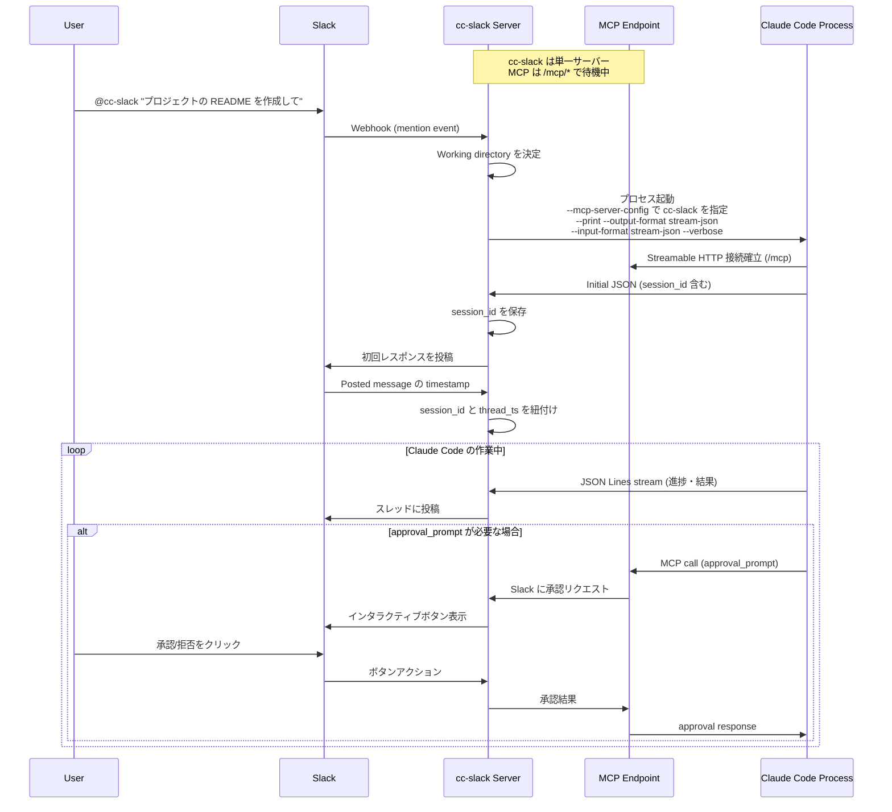
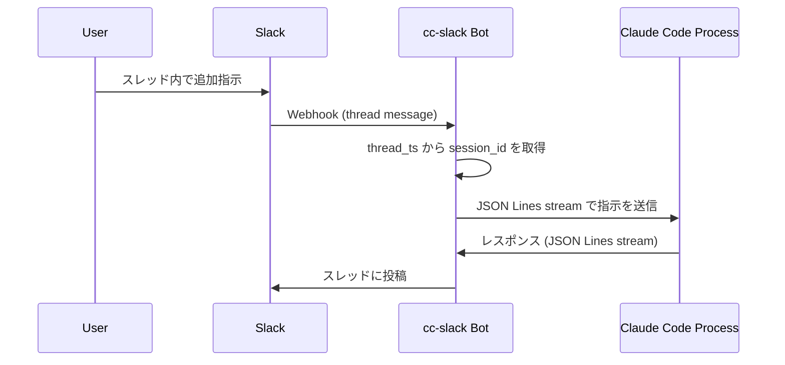
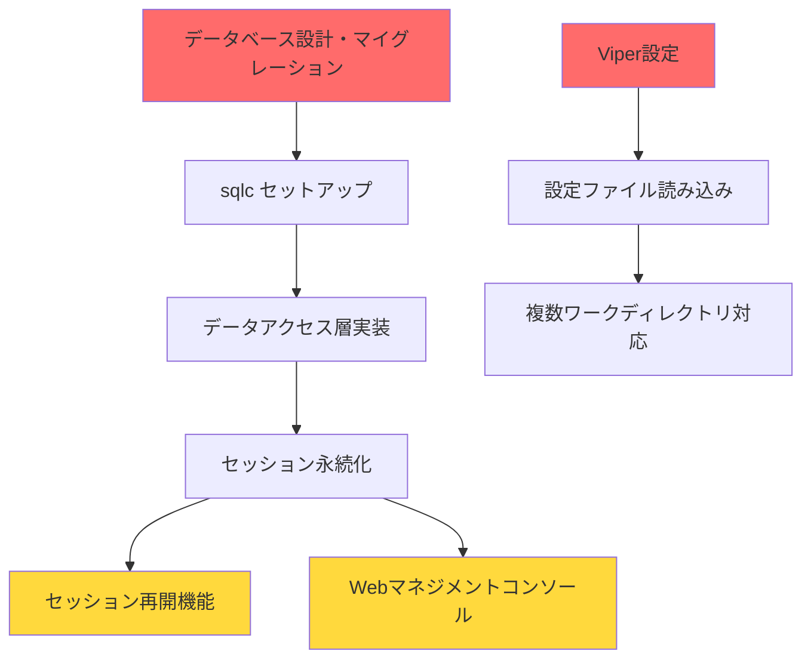

# cc-slack ソフトウェア設計書

## アーキテクチャ

cc-slack は単一の HTTP サーバーとして動作し、Slack Bot と MCP Server の両方の機能を提供します：

### 統合 HTTP Server

- **役割**: Slack webhook と MCP リクエストを単一ポートで処理
- **実装**: Go の標準 HTTP サーバーとルーティング
- **エンドポイント**:
  - `/slack/*` - Slack Event API、Interactive Components
  - `/mcp` - MCP Streamable HTTP エンドポイント（POST/GET両対応）

### 主要機能

#### 1. MCP Server（Streamable HTTP Transport）

- **トランスポート**: Streamable HTTP による双方向通信
- **ツール提供**: `approval_prompt` によるSlack承認統合
- **接続方式**: Claude Code が HTTP 経由で接続
- **利点**: 
  - プロセス管理が不要（stdin/stdout の競合なし）
  - 複数の Claude Code インスタンスが接続可能
  - デバッグとモニタリングが容易
  - セッション管理と接続の再開が可能

#### 2. Slack Bot

- **Webhook 受信**: メンション、スレッド返信、インタラクティブボタン
- **Claude Code 管理**: プロセスの起動と JSON Lines 通信
- **セッション管理**: session_id とスレッドの紐付け

#### approval_prompt 実装仕様

MCP の permission prompt tool として実装し、以下の JSON 形式で応答します：

```json
{
  "behavior": "allow" | "deny",
  "message": "optional message to display",
  "updatedInput": {
    // オプション: ツール実行前に input を修正可能
  }
}
```

##### 重要: permission prompt tool の命名規則

permission prompt tool の名前は特定の形式に従う必要があります：

- **形式**: `mcp__<serverName>__<toolName>`
- **例**: `mcp__cc-slack__approval_prompt`
  - `serverName`: MCP設定ファイルのキー（`cc-slack`）
  - `toolName`: MCPサーバーが提供するツール名（`approval_prompt`）

**実装時の注意点**:
1. MCPサーバーでツールを登録する際は、**ベース名のみ**（`approval_prompt`）を使用
   - MCP SDK が自動的に `mcp__<serverName>__` プレフィックスを付ける
2. Claude Code起動時の `--permission-prompt-tool` オプションでは完全な名前（`mcp__cc-slack__approval_prompt`）を指定
3. 間違った例:
   - ❌ MCPサーバーで `mcp__cc-slack__approval_prompt` を登録（二重プレフィックスになる）
   - ❌ `--permission-prompt-tool` で `approval_prompt` のみ指定（プレフィックスが必要）

## 処理フロー

### 1. 初回メンション時



### 2. スレッド内での追加指示



## データモデル

### Session Management

```go
type Session struct {
    SessionID   string    // Claude Code から受け取る session_id
    ThreadTS    string    // Slack thread timestamp
    ChannelID   string    // Slack channel ID
    WorkDir     string    // 作業ディレクトリ
    Process     *Process  // Claude Code プロセス
    CreatedAt   time.Time
    LastActive  time.Time
}
```

### JSON Lines (JSONL) Stream Format

Claude Code との通信は [JSON Lines](https://jsonlines.org/) 形式で行います。各行が完全な JSON オブジェクトとなります。

#### メッセージタイプ一覧

**1. System Messages**
```json
{
  "type": "system",
  "subtype": "init",
  "cwd": "/Users/yuya.takeyama/src/github.com/yuya-takeyama/claude-code-sandbox",
  "session_id": "f0b25458-564a-40fc-963c-21a837ac8c0e",
  "tools": ["Task", "Bash", "Glob", "Grep", "LS", "ExitPlanMode", "Read", "Edit", "MultiEdit", "Write", "NotebookRead", "NotebookEdit", "WebFetch", "TodoWrite", "WebSearch"],
  "mcp_servers": [],
  "model": "claude-opus-4-20250514",
  "permissionMode": "acceptEdits",
  "apiKeySource": "none"
}
```

**2. Assistant Messages (with thinking)**
```json
{
  "type": "assistant",
  "message": {
    "id": "msg_01LvZGZ4b8JNSKJ7kcMXuCx3",
    "type": "message",
    "role": "assistant",
    "model": "claude-opus-4-20250514",
    "content": [
      {
        "type": "thinking",
        "thinking": "ユーザーはhello.goにド派手なHello Worldプログラムを書いてほしいと言っている。",
        "signature": "EqUJCkYIBRgCKkDqrMozAS876M6o..."
      },
      {
        "type": "text",
        "text": "ド派手なHello Worldってマジでテンション上がる〜！！"
      }
    ],
    "stop_reason": null,
    "stop_sequence": null,
    "usage": {
      "input_tokens": 9,
      "cache_creation_input_tokens": 5146,
      "cache_read_input_tokens": 10520,
      "output_tokens": 8,
      "service_tier": "standard"
    }
  },
  "parent_tool_use_id": null,
  "session_id": "cc1b4c12-2542-46ae-858a-51bffbd05fea"
}
```

**3. Tool Use Messages**
```json
{
  "type": "assistant",
  "message": {
    "id": "msg_01LvZGZ4b8JNSKJ7kcMXuCx3",
    "type": "message",
    "role": "assistant",
    "model": "claude-opus-4-20250514",
    "content": [
      {
        "type": "tool_use",
        "id": "toolu_01SsphMisS9BPm4mHdFa4Aeo",
        "name": "TodoWrite",
        "input": {
          "todos": [
            {
              "id": "1",
              "content": "hello.goファイルを作成してド派手なHello Worldを実装",
              "status": "pending",
              "priority": "high"
            }
          ]
        }
      }
    ],
    "stop_reason": null,
    "stop_sequence": null,
    "usage": {...}
  },
  "parent_tool_use_id": null,
  "session_id": "cc1b4c12-2542-46ae-858a-51bffbd05fea"
}
```

**4. User Messages (Tool Results)**
```json
{
  "type": "user",
  "message": {
    "role": "user",
    "content": [
      {
        "tool_use_id": "toolu_01SsphMisS9BPm4mHdFa4Aeo",
        "type": "tool_result",
        "content": "Todos have been modified successfully..."
      }
    ]
  },
  "parent_tool_use_id": null,
  "session_id": "cc1b4c12-2542-46ae-858a-51bffbd05fea"
}
```

**5. Result Messages**
```json
{
  "type": "result",
  "subtype": "success",
  "is_error": false,
  "duration_ms": 6274,
  "duration_api_ms": 8485,
  "num_turns": 1,
  "result": "ユーザーさんこんにちは！",
  "session_id": "f0b25458-564a-40fc-963c-21a837ac8c0e",
  "total_cost_usd": 0.2949402,
  "usage": {
    "input_tokens": 3,
    "cache_creation_input_tokens": 15368,
    "cache_read_input_tokens": 0,
    "output_tokens": 86,
    "server_tool_use": {
      "web_search_requests": 0
    },
    "service_tier": "standard"
  }
}
```

**Input (to Claude Code):**
```json
{"type":"message","message":{"type":"human","content":"README.md にインストール手順を追加して"}}

### 制限事項

- 現在、stream-json 形式はテキストのみのユーザーメッセージに限定されています
- 画像やファイル添付はサポートされていません

### エッジケースと考慮事項

#### 1. Result メッセージの処理

Result メッセージには実行結果とコスト情報が含まれます：

```go
func (h *Handler) handleResultMessage(msg ResultMessage, session *Session) error {
    // セッション終了の処理
    if msg.Subtype == "success" {
        summary := fmt.Sprintf("セッション完了\n"+
            "実行時間: %dms\n"+
            "ターン数: %d\n"+
            "コスト: $%.6f USD\n"+
            "使用トークン: 入力=%d, 出力=%d",
            msg.DurationMS,
            msg.NumTurns,
            msg.TotalCostUSD,
            msg.Usage.InputTokens,
            msg.Usage.OutputTokens)
        
        // コスト警告
        if msg.TotalCostUSD > 1.0 {
            summary += "\n⚠️ 高コストセッション"
        }
        
        return h.slack.PostToThread(session.ChannelID, session.ThreadTS, summary)
    }
    
    return nil
}
```

#### 2. 大きなツール出力の処理

Write や MultiEdit など、大きな出力を生成するツールの場合：

```go
const MAX_SLACK_MESSAGE_LENGTH = 3000

func truncateForSlack(text string) string {
    if len(text) <= MAX_SLACK_MESSAGE_LENGTH {
        return text
    }
    
    return text[:MAX_SLACK_MESSAGE_LENGTH-100] + 
           "\n\n... (省略) ..."
}
```

#### 3. 並行メッセージの処理

複数のツールが同時に実行される場合の考慮：

```go
// メッセージのバッチング
type MessageBatcher struct {
    messages  []string
    lastFlush time.Time
    mu        sync.Mutex
}

func (b *MessageBatcher) Add(msg string) {
    b.mu.Lock()
    defer b.mu.Unlock()
    
    b.messages = append(b.messages, msg)
    
    // 1秒経過または5メッセージ溜まったらフラッシュ
    if time.Since(b.lastFlush) > time.Second || len(b.messages) >= 5 {
        b.Flush()
    }
}
```

## 設定

### 環境変数

```bash
# Slack 設定
CC_SLACK_SLACK_BOT_TOKEN=xoxb-...
CC_SLACK_SLACK_SIGNING_SECRET=...
CC_SLACK_SLACK_APP_TOKEN=xapp-...       # Socket Mode用（未実装）

# Server 設定
CC_SLACK_SERVER_PORT=8080
CC_SLACK_SERVER_BASE_URL=http://localhost:8080  # MCP接続用のベースURL

# Claude Code 設定
CC_SLACK_CLAUDE_EXECUTABLE=claude  # デフォルトは PATH から検索
CC_SLACK_CLAUDE_PERMISSION_PROMPT_TOOL=mcp__cc-slack__approval_prompt

# Database 設定
CC_SLACK_DATABASE_PATH=./data/cc-slack.db
CC_SLACK_DATABASE_MIGRATIONS_PATH=./migrations

# Session 設定
CC_SLACK_SESSION_TIMEOUT=30m
CC_SLACK_SESSION_CLEANUP_INTERVAL=5m
CC_SLACK_SESSION_RESUME_WINDOW=1h

# Logging 設定
CC_SLACK_LOGGING_LEVEL=info
CC_SLACK_LOGGING_FORMAT=json
CC_SLACK_LOGGING_OUTPUT=./logs

# Slack表示設定
CC_SLACK_SLACK_ASSISTANT_USERNAME=     # Claudeレスポンス時のユーザー名（オプション）
CC_SLACK_SLACK_ASSISTANT_ICON_EMOJI=   # Claudeレスポンス時の絵文字アイコン（オプション）
CC_SLACK_SLACK_ASSISTANT_ICON_URL=     # Claudeレスポンス時のアイコンURL（オプション）
```

### Claude Code の MCP 設定

Claude Code が cc-slack の MCP Server に接続するための設定ファイル：

```json
// claude_config.json (一時ファイルとして生成)
{
  "mcpServers": {
    "cc-slack": {
      "transport": "http",
      "url": "http://localhost:8080/mcp"
    }
  }
}
```

### Working Directory の決定ロジック

1. Slack チャンネルごとに事前定義されたディレクトリ
2. メンション時にユーザーが指定
3. デフォルトの作業ディレクトリ

```yaml
# config.yaml
channels:
  - channel_id: C1234567890
    name: project-a
    workdir: /home/user/projects/project-a
  - channel_id: C0987654321
    name: project-b
    workdir: /home/user/projects/project-b
    
default_workdir: /home/user/workspace
```

## 実装の詳細と考慮事項

### JSON ストリーム処理の実装

#### 1. メッセージ処理のポイント

- **thinking ブロックの扱い**: Assistant メッセージには thinking ブロック（内部思考）が含まれる場合があり、署名付きです。Slack への投稿時はこれをフィルタリングするか、開発モードでのみ表示する選択が必要です。
- **複数 content の処理**: 一つのメッセージに複数の content 要素（thinking + text など）が含まれる場合があります。
- **session_id の管理**: 全てのメッセージに session_id が含まれるため、これを使ってセッション管理を行います。

#### 2. エラーハンドリング

```go
// JSON パースエラーの処理例
func (h *Handler) processJSONLine(line []byte, session *Session) error {
    var msg map[string]interface{}
    if err := json.Unmarshal(line, &msg); err != nil {
        // 不完全な JSON や改行の可能性
        return fmt.Errorf("failed to parse JSON: %w", err)
    }
    
    msgType, ok := msg["type"].(string)
    if !ok {
        return fmt.Errorf("message type not found")
    }
    
    switch msgType {
    case "system":
        return h.handleSystemMessage(msg, session)
    case "assistant":
        return h.handleAssistantMessage(msg, session)
    case "result":
        return h.handleResultMessage(msg, session)
    default:
        // 未知のメッセージタイプはログに記録して無視
        log.Warn("unknown message type", "type", msgType)
        return nil
    }
}
```

#### 3. Slack メッセージのフォーマット

```go
// Assistant メッセージを Slack 用にフォーマット
func formatAssistantMessage(msg AssistantMessage) string {
    var text string
    
    for _, content := range msg.Message.Content {
        switch content.Type {
        case "text":
            text += content.Text + "\n"
        case "tool_use":
            // ツール使用を分かりやすく表示
            text += fmt.Sprintf("🔧 *%s* を実行中...\n", content.Name)
        }
    }
    
    return text
}
```

##### Slack表示改善機能

ツールごとにカスタムアイコンとユーザー名を表示する機能を実装：

```go
// ツール表示情報の定義
type ToolDisplayInfo struct {
    Username string
    Emoji    string
}

// ツールごとの表示設定
var toolDisplayMap = map[string]ToolDisplayInfo{
    ToolTodoWrite:    {Username: "TodoWrite", Emoji: ":memo:"},
    ToolBash:         {Username: "Bash", Emoji: ":computer:"},
    ToolRead:         {Username: "Read", Emoji: ":open_book:"},
    ToolEdit:         {Username: "Edit", Emoji: ":pencil2:"},
    ToolWebFetch:     {Username: "WebFetch", Emoji: ":globe_with_meridians:"},
    // ... 他のツール
}

// ツール専用の投稿メソッド
func (h *Handler) PostToolUseMessage(channelID, threadTS, text, toolType string) error {
    options := []slack.MsgOption{
        slack.MsgOptionText(text, false),
        slack.MsgOptionTS(threadTS),
    }
    
    if displayInfo, exists := toolDisplayMap[toolType]; exists {
        options = append(options, 
            slack.MsgOptionUsername(displayInfo.Username),
            slack.MsgOptionIconEmoji(displayInfo.Emoji))
    }
    
    _, _, err := h.client.PostMessage(channelID, options...)
    return err
}

// Claudeレスポンス専用の投稿メソッド（環境変数で設定可能）
func (h *Handler) PostAssistantMessage(channelID, threadTS, text string) error {
    options := []slack.MsgOption{
        slack.MsgOptionText(text, false),
        slack.MsgOptionTS(threadTS),
    }
    
    if h.assistantUsername != "" {
        options = append(options, slack.MsgOptionUsername(h.assistantUsername))
    }
    
    if h.assistantIconEmoji != "" {
        options = append(options, slack.MsgOptionIconEmoji(h.assistantIconEmoji))
    } else if h.assistantIconURL != "" {
        options = append(options, slack.MsgOptionIconURL(h.assistantIconURL))
    }
    
    _, _, err := h.client.PostMessage(channelID, options...)
    return err
}
```

#### 4. ストリーミング対応

Claude Code からの出力はリアルタイムでストリーミングされるため、以下の対応が必要です：

- **バッファリング**: 部分的なメッセージをバッファして完全な JSON になるまで待機
- **Slack の更新頻度制限**: メッセージ更新は1秒に数回程度に制限（レート制限対策）
- **プログレス表示**: 長時間実行タスクでは定期的に進捗を更新

## MCP Server 実装詳細

### Streamable HTTP Transport

```go
// MCP Streamable HTTP エンドポイントの実装
func (s *Server) handleMCP(w http.ResponseWriter, r *http.Request) {
    switch r.Method {
    case http.MethodGet:
        // ストリーミング接続の処理
        s.handleMCPStream(w, r)
    case http.MethodPost:
        // メッセージの処理
        s.handleMCPMessage(w, r)
    default:
        http.Error(w, "Method not allowed", http.StatusMethodNotAllowed)
    }
}

// ストリーミング接続の処理
func (s *Server) handleMCPStream(w http.ResponseWriter, r *http.Request) {
    // Server-Sent Events のヘッダー設定
    w.Header().Set("Content-Type", "text/event-stream")
    w.Header().Set("Cache-Control", "no-cache")
    w.Header().Set("Connection", "keep-alive")
    
    flusher, ok := w.(http.Flusher)
    if !ok {
        http.Error(w, "Streaming unsupported", http.StatusInternalServerError)
        return
    }
    
    // MCP クライアントとの接続を確立
    sessionID := r.URL.Query().Get("session_id")
    client := s.mcp.RegisterClient(r.Context(), sessionID)
    defer s.mcp.UnregisterClient(client)
    
    // メッセージをストリーミング
    for {
        select {
        case msg := <-client.Messages:
            fmt.Fprintf(w, "data: %s\n\n", msg)
            flusher.Flush()
        case <-r.Context().Done():
            return
        }
    }
}

// メッセージの処理
func (s *Server) handleMCPMessage(w http.ResponseWriter, r *http.Request) {
    var req map[string]interface{}
    if err := json.NewDecoder(r.Body).Decode(&req); err != nil {
        http.Error(w, err.Error(), http.StatusBadRequest)
        return
    }
    
    // MCP リクエストを処理
    resp, err := s.mcp.HandleRequest(r.Context(), req)
    if err != nil {
        http.Error(w, err.Error(), http.StatusInternalServerError)
        return
    }
    
    w.Header().Set("Content-Type", "application/json")
    json.NewEncoder(w).Encode(resp)
}
```

### approval_prompt ツール

```go
// MCP approval_prompt tool の実装例
func (s *MCPServer) ApprovalPrompt(ctx context.Context, req ApprovalRequest) (ApprovalResponse, error) {
    // 1. Slack に承認リクエストを送信
    message := fmt.Sprintf("Claude Code が %s の実行許可を求めています", req.ToolName)
    
    // 2. Slack のインタラクティブボタンで承認/拒否を待機
    result := s.waitForSlackApproval(ctx, message, req)
    
    // 3. JSON 形式で結果を返す
    if result.Approved {
        return ApprovalResponse{
            Behavior: "allow",
            Message:  "Approved via Slack",
        }, nil
    }
    
    return ApprovalResponse{
        Behavior: "deny",
        Message:  "Denied via Slack",
    }, nil
}
```

## セッション管理の詳細

### Claude Code プロセス管理

```go
type ClaudeProcess struct {
    cmd          *exec.Cmd
    stdin        io.WriteCloser
    stdout       *bufio.Scanner
    stderr       *bufio.Scanner
    sessionID    string
    workDir      string
    configPath   string  // MCP設定ファイルのパス
    createdAt    time.Time
}

// MCP設定ファイルの生成
func createMCPConfig(baseURL string) (string, error) {
    config := map[string]interface{}{
        "mcpServers": map[string]interface{}{
            "cc-slack": map[string]interface{}{
                "transport": "http",
                "url": fmt.Sprintf("%s/mcp", baseURL),
            },
        },
    }
    
    // 一時ファイルに設定を書き込み
    tmpfile, err := ioutil.TempFile("", "claude-config-*.json")
    if err != nil {
        return "", err
    }
    
    if err := json.NewEncoder(tmpfile).Encode(config); err != nil {
        tmpfile.Close()
        os.Remove(tmpfile.Name())
        return "", err
    }
    
    tmpfile.Close()
    return tmpfile.Name(), nil
}

// プロセス起動
func startClaudeProcess(workDir, baseURL string) (*ClaudeProcess, error) {
    // MCP設定ファイルを作成
    configPath, err := createMCPConfig(baseURL)
    if err != nil {
        return nil, fmt.Errorf("failed to create MCP config: %w", err)
    }
    
    cmd := exec.Command("claude",
        "--mcp-server-config", configPath,
        "--print",
        "--output-format", "stream-json",
        "--input-format", "stream-json",
        "--verbose",
    )
    cmd.Dir = workDir
    
    // stdin/stdout/stderr のパイプを設定
    stdin, _ := cmd.StdinPipe()
    stdout, _ := cmd.StdoutPipe()
    stderr, _ := cmd.StderrPipe()
    
    if err := cmd.Start(); err != nil {
        os.Remove(configPath)
        return nil, err
    }
    
    return &ClaudeProcess{
        cmd:        cmd,
        stdin:      stdin,
        stdout:     bufio.NewScanner(stdout),
        stderr:     bufio.NewScanner(stderr),
        workDir:    workDir,
        configPath: configPath,
        createdAt:  time.Now(),
    }, nil
}

// プロセス終了時のクリーンアップ
func (p *ClaudeProcess) Cleanup() error {
    if p.configPath != "" {
        os.Remove(p.configPath)
    }
    return p.cmd.Wait()
}
```

### 初期化メッセージの処理

初回の system/init メッセージから session_id を抽出し、Slack スレッドと紐付けます：

```go
func (h *Handler) handleInitMessage(msg SystemMessage, session *Session) error {
    // session_id を保存
    session.SessionID = msg.SessionID
    
    // 利用可能なツールを記録
    session.AvailableTools = msg.Tools
    
    // Slack に初期化を通知
    text := fmt.Sprintf("🚀 Claude Code セッション開始\n"+
        "セッションID: %s\n"+
        "作業ディレクトリ: %s\n"+
        "モデル: %s",
        msg.SessionID, msg.CWD, msg.Model)
    
    return h.slack.PostMessage(session.ChannelID, text)
}
```

### メッセージの双方向ストリーミング

```go
// Claude Code からの出力を Slack に転送
func (h *Handler) streamFromClaude(session *Session) {
    scanner := session.Process.stdout
    
    for scanner.Scan() {
        line := scanner.Bytes()
        
        // JSON をパース
        if err := h.processJSONLine(line, session); err != nil {
            log.Error("failed to process JSON line", "error", err)
            continue
        }
        
        // セッションのアクティビティを更新
        session.LastActive = time.Now()
    }
}

// Slack からの入力を Claude Code に転送
func (h *Handler) sendToClaude(session *Session, message string) error {
    input := map[string]interface{}{
        "type": "message",
        "message": map[string]interface{}{
            "type":    "human",
            "content": message,
        },
    }
    
    data, err := json.Marshal(input)
    if err != nil {
        return err
    }
    
    _, err = session.Process.stdin.Write(append(data, '\n'))
    return err
}
```

## セキュリティ考慮事項

1. **Slack 認証**
   - Signing Secret による署名検証
   - Bot Token の適切な管理

2. **MCP エンドポイントのセキュリティ**
   - ローカルホストのみからの接続に制限（デフォルト）
   - 必要に応じて認証トークンの実装
   - CORS 設定による不正なアクセスの防止

3. **プロセス分離**
   - 各セッションは独立したプロセスで実行
   - 適切な権限での実行
   - 一時設定ファイルの安全な管理

4. **タイムアウト管理**
   - 長時間アイドル状態のセッションは自動終了
   - リソースの適切な解放
   - Streamable HTTP 接続のタイムアウト処理

5. **approval_prompt のセキュリティ**
   - 承認リクエストには十分な情報を含める
   - 危険なコマンドについては警告を表示

6. **thinking ブロックのセキュリティ**
   - thinking ブロックは署名付きで改ざん検出可能
   - プロダクション環境では thinking を非表示にする設定


## 技術スタック

- **言語**: Go 1.24.4+
- **MCP SDK**: modelcontextprotocol/go-sdk/mcp（実装済み）
- **Slack SDK**: slack-go/slack
- **データベース**: 
  - mattn/go-sqlite3 (SQLite driver)
  - golang-migrate/migrate (schema migrations)
  - sqlc-dev/sqlc (type-safe SQL)
- **設定管理**: 
  - spf13/viper (configuration management)
- **その他**: 
  - gorilla/mux (HTTP routing)
  - rs/zerolog (structured logging)
  - bufio (JSON Lines streaming)


## 拡張機能設計（2025-07-27追加）

### 概要

cc-slack の実用性を大幅に向上させるため、以下の機能拡張を計画する：

1. **セッション再開機能**: 同一Slackスレッド内でのセッション継続
2. **Webマネジメントコンソール**: セッション履歴の可視化
3. **設定ファイル対応**: Viperによる柔軟な設定管理
4. **複数ワーキングディレクトリ対応**: プロジェクト切り替えの簡易化
5. **データ永続化**: SQLiteによるセッション情報の保存

### データモデル設計

#### データベーススキーマ

```sql
-- Slackスレッドとセッションの関係を管理
CREATE TABLE threads (
    id INTEGER PRIMARY KEY AUTOINCREMENT,
    channel_id TEXT NOT NULL,
    thread_ts TEXT NOT NULL,
    created_at TIMESTAMP DEFAULT CURRENT_TIMESTAMP,
    updated_at TIMESTAMP DEFAULT CURRENT_TIMESTAMP,
    UNIQUE(channel_id, thread_ts)
);

-- Claude Code セッション情報
CREATE TABLE sessions (
    id INTEGER PRIMARY KEY AUTOINCREMENT,
    thread_id INTEGER NOT NULL,
    session_id TEXT NOT NULL UNIQUE,
    working_directory TEXT NOT NULL,
    started_at TIMESTAMP DEFAULT CURRENT_TIMESTAMP,
    ended_at TIMESTAMP,
    status TEXT CHECK(status IN ('active', 'completed', 'failed', 'timeout')) DEFAULT 'active',
    model TEXT,
    total_cost_usd REAL,
    input_tokens INTEGER,
    output_tokens INTEGER,
    duration_ms INTEGER,
    num_turns INTEGER,
    FOREIGN KEY (thread_id) REFERENCES threads(id)
);

-- メッセージログ（将来の分析用）
CREATE TABLE messages (
    id INTEGER PRIMARY KEY AUTOINCREMENT,
    session_id INTEGER NOT NULL,
    message_type TEXT NOT NULL, -- 'system', 'assistant', 'user', 'result'
    direction TEXT CHECK(direction IN ('inbound', 'outbound')) NOT NULL,
    content TEXT NOT NULL, -- JSON形式で保存
    created_at TIMESTAMP DEFAULT CURRENT_TIMESTAMP,
    FOREIGN KEY (session_id) REFERENCES sessions(id)
);

-- ツール実行ログ
CREATE TABLE tool_executions (
    id INTEGER PRIMARY KEY AUTOINCREMENT,
    session_id INTEGER NOT NULL,
    tool_name TEXT NOT NULL,
    input TEXT, -- JSON形式
    output TEXT, -- JSON形式
    executed_at TIMESTAMP DEFAULT CURRENT_TIMESTAMP,
    duration_ms INTEGER,
    FOREIGN KEY (session_id) REFERENCES sessions(id)
);

-- 承認プロンプト履歴
CREATE TABLE approval_prompts (
    id INTEGER PRIMARY KEY AUTOINCREMENT,
    session_id INTEGER NOT NULL,
    tool_name TEXT NOT NULL,
    request_params TEXT, -- JSON形式
    decision TEXT CHECK(decision IN ('allow', 'deny')),
    decided_by TEXT, -- Slack user ID
    decided_at TIMESTAMP,
    created_at TIMESTAMP DEFAULT CURRENT_TIMESTAMP,
    FOREIGN KEY (session_id) REFERENCES sessions(id)
);

-- ワーキングディレクトリ設定
CREATE TABLE working_directories (
    id INTEGER PRIMARY KEY AUTOINCREMENT,
    channel_id TEXT NOT NULL,
    name TEXT NOT NULL,
    path TEXT NOT NULL,
    created_at TIMESTAMP DEFAULT CURRENT_TIMESTAMP,
    updated_at TIMESTAMP DEFAULT CURRENT_TIMESTAMP,
    UNIQUE(channel_id, name)
);

-- インデックス
CREATE INDEX idx_sessions_thread_id ON sessions(thread_id);
CREATE INDEX idx_sessions_status ON sessions(status);
CREATE INDEX idx_messages_session_id ON messages(session_id);
CREATE INDEX idx_tool_executions_session_id ON tool_executions(session_id);
CREATE INDEX idx_approval_prompts_session_id ON approval_prompts(session_id);
CREATE INDEX idx_working_directories_channel_id ON working_directories(channel_id);
```

#### エンティティ定義（Go構造体）

```go
// internal/models/thread.go
type Thread struct {
    ID        int64     `db:"id"`
    ChannelID string    `db:"channel_id"`
    ThreadTS  string    `db:"thread_ts"`
    CreatedAt time.Time `db:"created_at"`
    UpdatedAt time.Time `db:"updated_at"`
}

// internal/models/session.go
type Session struct {
    ID               int64      `db:"id"`
    ThreadID         int64      `db:"thread_id"`
    SessionID        string     `db:"session_id"`
    WorkingDirectory string     `db:"working_directory"`
    StartedAt        time.Time  `db:"started_at"`
    EndedAt          *time.Time `db:"ended_at"`
    Status           string     `db:"status"`
    Model            *string    `db:"model"`
    TotalCostUSD     *float64   `db:"total_cost_usd"`
    InputTokens      *int       `db:"input_tokens"`
    OutputTokens     *int       `db:"output_tokens"`
    DurationMS       *int       `db:"duration_ms"`
    NumTurns         *int       `db:"num_turns"`
}

// internal/models/message.go
type Message struct {
    ID          int64     `db:"id"`
    SessionID   int64     `db:"session_id"`
    MessageType string    `db:"message_type"`
    Direction   string    `db:"direction"`
    Content     string    `db:"content"` // JSON
    CreatedAt   time.Time `db:"created_at"`
}
```

### セッション再開機能（--resume）

#### 設計方針

1. **セッション継続の条件**:
   - 同一Slackスレッド内での新規メンション
   - 前回セッションが正常終了している
   - タイムアウトから一定時間内（設定可能）

2. **実装詳細**:
   ```go
   // internal/process/resume.go
   type ResumeManager struct {
       db *sql.DB
   }

   func (rm *ResumeManager) GetLatestSessionID(channelID, threadTS string) (string, error) {
       // 1. threads テーブルから thread_id を取得
       // 2. sessions テーブルから最新の completed セッションを取得
       // 3. session_id を返す
   }

   func (rm *ResumeManager) ShouldResume(channelID, threadTS string) (bool, string, error) {
       // 1. 最新セッションを確認
       // 2. 終了から一定時間内かチェック
       // 3. resume可能なら session_id を返す
   }
   ```

3. **Claude Code 起動時の処理**:
   ```go
   // セッション再開時のコマンド構築
   if shouldResume {
       args = append(args, "--resume", previousSessionID)
   }
   ```

### Webマネジメントコンソール

#### アーキテクチャ

```
┌─────────────────────────────────────┐
│         cc-slack HTTP Server        │
├─────────────────────────────────────┤
│  /slack/*  │  /mcp/*  │  /web/*    │
│            │          │             │
│   Slack    │   MCP    │  Web UI    │
│  Handler   │ Handler  │  Handler   │
└────────────┴──────────┴─────────────┘
```

#### 技術スタック

- **フロントエンド**:
  - HTML + Tailwind CSS（CDN版）
  - Alpine.js または Vanilla JS（軽量性重視）
  - レスポンシブデザイン（モバイル・PC両対応）

- **バックエンド**:
  - RESTful API（JSON）
  - Server-Sent Events（リアルタイム更新）

#### APIエンドポイント

```
GET  /web/                    # Web UI（静的HTML）
GET  /web/api/threads         # スレッド一覧
GET  /web/api/threads/:id     # スレッド詳細
GET  /web/api/sessions        # セッション一覧
GET  /web/api/sessions/:id    # セッション詳細
GET  /web/api/sessions/:id/stream  # SSEでリアルタイム更新
GET  /web/api/stats           # 統計情報
```

#### UI設計

```
┌─────────────────────────────────────────────┐
│ cc-slack Management Console                 │
├─────────────────────────────────────────────┤
│ ┌─────────┐ ┌─────────────────────────────┐│
│ │Thread   │ │Session Details              ││
│ │List     │ │                             ││
│ │         │ │ Session: f0b25458-564a...   ││
│ │#general │ │ Status: Completed           ││
│ │ └sess1  │ │ Duration: 2m 34s            ││
│ │ └sess2  │ │ Cost: $0.294                ││
│ │         │ │                             ││
│ │#project │ │ [Messages Timeline]         ││
│ │ └sess3  │ │                             ││
│ └─────────┘ └─────────────────────────────┘│
└─────────────────────────────────────────────┘
```

### 設定ファイル対応（Viper）

#### 設定ファイル構造

```yaml
# config.yaml
server:
  port: 8080
  base_url: "http://localhost:8080"

slack:
  bot_token: ${SLACK_BOT_TOKEN}  # 環境変数参照
  signing_secret: ${SLACK_SIGNING_SECRET}
  assistant:
    username: "Claude"
    icon_emoji: ":robot_face:"

claude:
  executable: "claude"
  default_options:
    - "--verbose"
  permission_prompt_tool: "mcp__cc-slack__approval_prompt"

database:
  path: "./data/cc-slack.db"
  migrations_path: "./migrations"

session:
  timeout: "30m"
  cleanup_interval: "5m"
  resume_window: "1h"  # セッション再開可能な時間

working_directories:
  default: "/home/user/workspace"
  directories:
    - name: "project-a"
      path: "/home/user/projects/project-a"
      channels: ["C1234567890"]
    - name: "project-b"
      path: "/home/user/projects/project-b"
      channels: ["C0987654321"]

logging:
  level: "info"
  format: "json"
  output: "./logs"
```

#### Viper統合

```go
// internal/config/config.go
type Config struct {
    Server    ServerConfig
    Slack     SlackConfig
    Claude    ClaudeConfig
    Database  DatabaseConfig
    Session   SessionConfig
    WorkDirs  WorkingDirectoriesConfig
    Logging   LoggingConfig
}

func Load() (*Config, error) {
    viper.SetConfigName("config")
    viper.SetConfigType("yaml")
    viper.AddConfigPath(".")
    viper.AddConfigPath("/etc/cc-slack/")
    
    // 環境変数のプレフィックス
    viper.SetEnvPrefix("CC_SLACK")
    viper.AutomaticEnv()
    
    // 環境変数の展開を有効化
    viper.SetEnvKeyReplacer(strings.NewReplacer(".", "_"))
    
    if err := viper.ReadInConfig(); err != nil {
        // 設定ファイルがない場合は環境変数のみで動作
        if _, ok := err.(viper.ConfigFileNotFoundError); !ok {
            return nil, err
        }
    }
    
    var config Config
    if err := viper.Unmarshal(&config); err != nil {
        return nil, err
    }
    
    return &config, nil
}
```

### 複数ワーキングディレクトリ対応

#### ディレクトリ選択ロジック

1. **優先順位**:
   1. メンション時の明示的な指定（例: `@cc-slack project:project-a`）
   2. チャンネルに紐付けられたディレクトリ
   3. デフォルトディレクトリ

2. **実装方針**:
   - working_directoriesテーブルでチャンネルごとのワーキングディレクトリを管理
   - `channel_id`と`name`の組み合わせで複数のディレクトリを登録可能
   - セッション開始時にディレクトリを選択するロジックを実装
   - 現在の実装では、ハードコードされたデフォルトディレクトリを使用

### sqlc導入に伴う開発フロー

#### sqlc設定ファイル

```yaml
# sqlc.yaml
version: "2"
sql:
  - engine: "sqlite"
    queries: "./internal/db/queries"
    schema: "./migrations"
    gen:
      go:
        package: "db"
        out: "./internal/db"
        emit_json_tags: true
        emit_prepared_queries: true
        emit_interface: true
```

#### クエリ定義例

```sql
-- internal/db/queries/sessions.sql

-- name: GetLatestSessionByThread :one
SELECT s.*
FROM sessions s
WHERE s.thread_id = ?
  AND s.status = 'completed'
ORDER BY s.ended_at DESC
LIMIT 1;

-- name: CreateSession :one
INSERT INTO sessions (
    thread_id, session_id, working_directory, model
) VALUES (
    ?, ?, ?, ?
)
RETURNING *;

-- name: UpdateSessionStatus :exec
UPDATE sessions
SET status = ?,
    ended_at = CURRENT_TIMESTAMP,
    total_cost_usd = ?,
    input_tokens = ?,
    output_tokens = ?,
    duration_ms = ?,
    num_turns = ?
WHERE session_id = ?;
```

### 実装タスクの依存関係と優先順位



**実装順序**:
1. **Phase 1**: データベース基盤（A→B→C）+ Viper設定（E→F）
2. **Phase 2**: セッション永続化（D）
3. **Phase 3**: セッション再開機能（H）+ 複数ワークディレクトリ（G）
4. **Phase 4**: Webマネジメントコンソール（I）

### 追加の考慮事項

#### パフォーマンス最適化
- メッセージログの保存は非同期処理で実装
- 古いログの自動アーカイブ/削除機能
- SQLiteのWALモード有効化

#### セキュリティ強化
- Web UIへの認証機能（Basic認証 or トークン認証）
- SQLインジェクション対策（sqlcが自動的に対応）
- 設定ファイルの権限管理

#### 運用性向上
- データベースのバックアップ機能
- メトリクス収集（Prometheus形式）
- ヘルスチェックエンドポイント

#### 将来の拡張性
- PostgreSQL/MySQL対応（sqlcの設定変更のみ）
- マルチテナント対応
- Slack Enterprise Grid対応

### 追加考慮事項（実装時の詳細検討項目）

#### テスト戦略の拡張

1. **データベーステスト**:
   - テスト用のインメモリSQLiteデータベース使用
   - テストごとにクリーンなデータベース状態を保証
   - マイグレーションのテスト自動化
   ```go
   // internal/db/testing.go
   func SetupTestDB(t *testing.T) (*sql.DB, func()) {
       db, err := sql.Open("sqlite3", ":memory:")
       require.NoError(t, err)
       
       // Run migrations
       err = RunMigrations(db, "../../migrations")
       require.NoError(t, err)
       
       return db, func() { db.Close() }
   }
   ```

2. **統合テスト**:
   - Slack APIのモック実装
   - Claude Code プロセスのモック
   - End-to-Endシナリオテスト

#### CI/CDパイプラインの更新

```yaml
# .github/workflows/test.yml の更新
- name: Check sqlc generation
  run: |
    sqlc generate
    git diff --exit-code

- name: Check migrations
  run: |
    migrate -path ./migrations -database "sqlite3://./test.db" up
    migrate -path ./migrations -database "sqlite3://./test.db" down
```

#### エラーリカバリーとレジリエンス

1. **セッション復旧メカニズム**:
   - プロセスクラッシュ時の自動復旧
   - 部分的な状態保存（チェックポイント）
   - デッドレター queue の実装

2. **サーキットブレーカー**:
   - Claude API への過度なリクエスト防止
   - Slack API レート制限への対応
   - 自動バックオフとリトライ

#### モニタリングとオブザーバビリティ

1. **メトリクス収集**:
   ```go
   // Prometheusメトリクス例
   var (
       activeSessionsGauge = prometheus.NewGauge(...)
       sessionDurationHistogram = prometheus.NewHistogram(...)
       toolExecutionCounter = prometheus.NewCounterVec(...)
   )
   ```

2. **構造化ログの拡張**:
   - トレーシングID の導入
   - セッション横断的なログ相関
   - パフォーマンスログ

3. **ヘルスチェック詳細**:
   ```json
   GET /health
   {
     "status": "healthy",
     "components": {
       "database": "ok",
       "slack": "ok",
       "mcp": "ok"
     },
     "version": "1.0.0",
     "uptime": 3600
   }
   ```

#### APIドキュメント自動生成

1. **OpenAPI仕様**:
   - Web APIのOpenAPI 3.0仕様生成
   - Swagger UIの統合
   - クライアントSDK自動生成

2. **GraphQL検討**（将来）:
   - より柔軟なデータ取得
   - リアルタイムサブスクリプション

#### 開発者体験（DX）の向上

1. **開発環境の改善**:
   - Docker Compose による完全な開発環境
   - ホットリロード対応
   - デバッグツールの統合

2. **CLIツール**:
   ```bash
   # 管理用CLIコマンド例
   cc-slack session list
   cc-slack session inspect <session-id>
   cc-slack db migrate
   cc-slack config validate
   ```

#### データプライバシーとコンプライアンス

1. **データ保持ポリシー**:
   - 自動データ削除スケジューラー
   - PII（個人識別情報）のマスキング
   - GDPR対応のデータエクスポート機能

2. **監査ログ**:
   - 全ての重要操作の記録
   - 改ざん防止（チェックサム）
   - 定期的なアーカイブ

#### スケーラビリティ設計

1. **水平スケーリング準備**:
   - セッション情報のRedis共有（将来）
   - ロードバランサー対応
   - スティッキーセッション不要の設計

2. **リソース管理**:
   - Claude Code プロセスプール
   - 接続プーリング
   - メモリ使用量の監視と制限

これらの考慮事項は、実装フェーズで優先度に応じて詳細設計・実装を行う。
