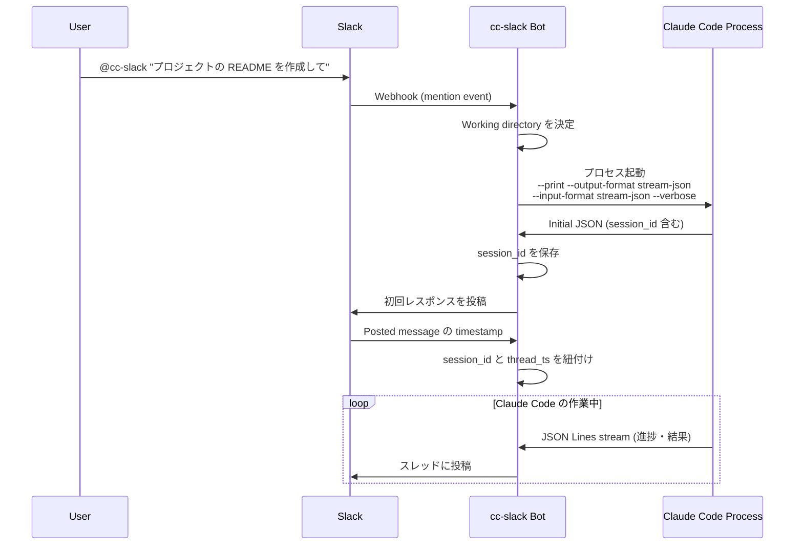
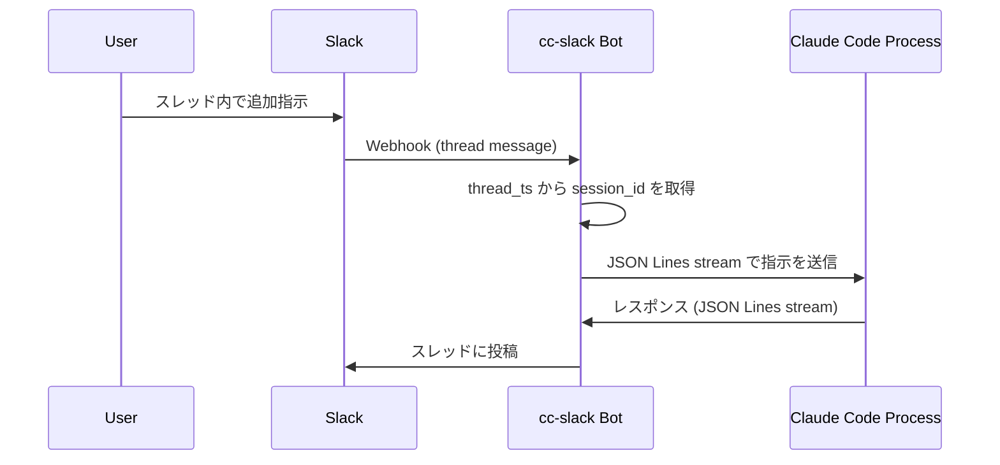

# cc-slack 設計書

## 概要

cc-slack は Claude Code と Slack 上でインタラクションするためのソフトウェアです。[cchh #16](https://github.com/yuya-takeyama/cchh/issues/16) で検討された「ゴロ寝コンピューティング」の問題に対する別アプローチとして、Slack 上で直接 Claude Code とやり取りすることで、よりシームレスな体験を提供します。

## 背景と動機

### 解決したい課題

1. **リモートワーク環境での Claude Code 利用**
   - ターミナルに張り付く必要がない
   - どこからでも作業の進捗を確認できる
   - モバイルデバイスからでも指示を出せる

2. **チームでの共同作業**
   - Slack スレッドで Claude Code の作業履歴を共有
   - チームメンバーが作業の流れを追跡可能
   - 非エンジニアメンバーも AI アシスタントの活用が可能

3. **非同期コミュニケーション**
   - 長時間実行タスクの進捗をSlackで確認
   - 必要に応じて途中で指示を追加

## アーキテクチャ

cc-slack は以下の2つの主要コンポーネントで構成されます：

### 1. MCP Server（メイン goroutine）

- **役割**: MCP（Model Context Protocol）サーバーとして動作
- **実装**: Go の標準 MCP SDK を使用した stdio トランスポート
- **機能**:
  - `approval_prompt` ツールの提供（カスタム permission prompt tool）
  - Claude Code との通信管理
  - 将来的な拡張のための基盤

#### approval_prompt 実装仕様

MCP の permission prompt tool として実装し、以下の JSON 形式で応答します：

```json
{
  "behavior": "allow" | "deny",
  "message": "optional message to display",
  "updatedInput": {
    // オプション: ツール実行前に input を修正可能
  }
}
```

### 2. Slack Bot HTTP Server（バックグラウンド goroutine）

- **役割**: Slack からの webhook を受信し、Claude Code プロセスを管理
- **実装**: HTTP サーバーとして Slack Event API/Slash Commands に対応
- **機能**:
  - Slack mention の受信
  - Claude Code プロセスの起動・管理
  - JSON Lines (JSONL) ストリームによる双方向通信
  - セッション管理（session_id とスレッドの紐付け）

## 処理フロー

### 1. 初回メンション時



### 2. スレッド内での追加指示



## データモデル

### Session Management

```go
type Session struct {
    SessionID   string    // Claude Code から受け取る session_id
    ThreadTS    string    // Slack thread timestamp
    ChannelID   string    // Slack channel ID
    WorkDir     string    // 作業ディレクトリ
    Process     *Process  // Claude Code プロセス
    CreatedAt   time.Time
    LastActive  time.Time
}
```

### JSON Lines (JSONL) Stream Format

Claude Code との通信は [JSON Lines](https://jsonlines.org/) 形式で行います。各行が完全な JSON オブジェクトとなります。

#### メッセージタイプ一覧

**1. System Messages**
```json
{
  "type": "system",
  "subtype": "init",
  "cwd": "/Users/yuya.takeyama/src/github.com/yuya-takeyama/claude-code-sandbox",
  "session_id": "f0b25458-564a-40fc-963c-21a837ac8c0e",
  "tools": ["Task", "Bash", "Glob", "Grep", "LS", "ExitPlanMode", "Read", "Edit", "MultiEdit", "Write", "NotebookRead", "NotebookEdit", "WebFetch", "TodoWrite", "WebSearch"],
  "mcp_servers": [],
  "model": "claude-opus-4-20250514",
  "permissionMode": "acceptEdits",
  "apiKeySource": "none"
}
```

**2. Assistant Messages (with thinking)**
```json
{
  "type": "assistant",
  "message": {
    "id": "msg_01LvZGZ4b8JNSKJ7kcMXuCx3",
    "type": "message",
    "role": "assistant",
    "model": "claude-opus-4-20250514",
    "content": [
      {
        "type": "thinking",
        "thinking": "ユーザーはhello.goにド派手なHello Worldプログラムを書いてほしいと言っている。",
        "signature": "EqUJCkYIBRgCKkDqrMozAS876M6o..."
      },
      {
        "type": "text",
        "text": "ド派手なHello Worldってマジでテンション上がる〜！！"
      }
    ],
    "stop_reason": null,
    "stop_sequence": null,
    "usage": {
      "input_tokens": 9,
      "cache_creation_input_tokens": 5146,
      "cache_read_input_tokens": 10520,
      "output_tokens": 8,
      "service_tier": "standard"
    }
  },
  "parent_tool_use_id": null,
  "session_id": "cc1b4c12-2542-46ae-858a-51bffbd05fea"
}
```

**3. Tool Use Messages**
```json
{
  "type": "assistant",
  "message": {
    "id": "msg_01LvZGZ4b8JNSKJ7kcMXuCx3",
    "type": "message",
    "role": "assistant",
    "model": "claude-opus-4-20250514",
    "content": [
      {
        "type": "tool_use",
        "id": "toolu_01SsphMisS9BPm4mHdFa4Aeo",
        "name": "TodoWrite",
        "input": {
          "todos": [
            {
              "id": "1",
              "content": "hello.goファイルを作成してド派手なHello Worldを実装",
              "status": "pending",
              "priority": "high"
            }
          ]
        }
      }
    ],
    "stop_reason": null,
    "stop_sequence": null,
    "usage": {...}
  },
  "parent_tool_use_id": null,
  "session_id": "cc1b4c12-2542-46ae-858a-51bffbd05fea"
}
```

**4. User Messages (Tool Results)**
```json
{
  "type": "user",
  "message": {
    "role": "user",
    "content": [
      {
        "tool_use_id": "toolu_01SsphMisS9BPm4mHdFa4Aeo",
        "type": "tool_result",
        "content": "Todos have been modified successfully..."
      }
    ]
  },
  "parent_tool_use_id": null,
  "session_id": "cc1b4c12-2542-46ae-858a-51bffbd05fea"
}
```

**5. Result Messages**
```json
{
  "type": "result",
  "subtype": "success",
  "is_error": false,
  "duration_ms": 6274,
  "duration_api_ms": 8485,
  "num_turns": 1,
  "result": "ユーザーさんこんにちは！",
  "session_id": "f0b25458-564a-40fc-963c-21a837ac8c0e",
  "total_cost_usd": 0.2949402,
  "usage": {
    "input_tokens": 3,
    "cache_creation_input_tokens": 15368,
    "cache_read_input_tokens": 0,
    "output_tokens": 86,
    "server_tool_use": {
      "web_search_requests": 0
    },
    "service_tier": "standard"
  }
}
```

**Input (to Claude Code):**
```json
{"type":"message","message":{"type":"human","content":"README.md にインストール手順を追加して"}}

### 制限事項

- 現在、stream-json 形式はテキストのみのユーザーメッセージに限定されています
- 画像やファイル添付はサポートされていません

### エッジケースと考慮事項

#### 1. Result メッセージの処理

Result メッセージには実行結果とコスト情報が含まれます：

```go
func (h *Handler) handleResultMessage(msg ResultMessage, session *Session) error {
    // セッション終了の処理
    if msg.Subtype == "success" {
        summary := fmt.Sprintf("✅ セッション完了\n"+
            "実行時間: %dms\n"+
            "ターン数: %d\n"+
            "コスト: $%.6f USD\n"+
            "使用トークン: 入力=%d, 出力=%d",
            msg.DurationMS,
            msg.NumTurns,
            msg.TotalCostUSD,
            msg.Usage.InputTokens,
            msg.Usage.OutputTokens)
        
        // コスト警告
        if msg.TotalCostUSD > 1.0 {
            summary += "\n⚠️ 高コストセッション"
        }
        
        return h.slack.PostToThread(session.ChannelID, session.ThreadTS, summary)
    }
    
    return nil
}
```

#### 2. 大きなツール出力の処理

Write や MultiEdit など、大きな出力を生成するツールの場合：

```go
const MAX_SLACK_MESSAGE_LENGTH = 3000

func truncateForSlack(text string) string {
    if len(text) <= MAX_SLACK_MESSAGE_LENGTH {
        return text
    }
    
    return text[:MAX_SLACK_MESSAGE_LENGTH-100] + 
           "\n\n... (省略) ..."
}
```

#### 3. 並行メッセージの処理

複数のツールが同時に実行される場合の考慮：

```go
// メッセージのバッチング
type MessageBatcher struct {
    messages  []string
    lastFlush time.Time
    mu        sync.Mutex
}

func (b *MessageBatcher) Add(msg string) {
    b.mu.Lock()
    defer b.mu.Unlock()
    
    b.messages = append(b.messages, msg)
    
    // 1秒経過または5メッセージ溜まったらフラッシュ
    if time.Since(b.lastFlush) > time.Second || len(b.messages) >= 5 {
        b.Flush()
    }
}
```

## 設定

### 環境変数

```bash
# Slack 設定
SLACK_BOT_TOKEN=xoxb-...
SLACK_SIGNING_SECRET=...

# cc-slack 設定
CC_SLACK_PORT=8080
CC_SLACK_DEFAULT_WORKDIR=/path/to/default/workspace

# Claude Code 設定
CLAUDE_CODE_PATH=claude  # デフォルトは PATH から検索

# MCP 設定
MCP_SERVER_NAME=cc-slack
```

### Working Directory の決定ロジック

1. Slack チャンネルごとに事前定義されたディレクトリ
2. メンション時にユーザーが指定
3. デフォルトの作業ディレクトリ

```yaml
# config.yaml
channels:
  - channel_id: C1234567890
    name: project-a
    workdir: /home/user/projects/project-a
  - channel_id: C0987654321
    name: project-b
    workdir: /home/user/projects/project-b
    
default_workdir: /home/user/workspace
```

## 実装の詳細と考慮事項

### JSON ストリーム処理の実装

#### 1. メッセージ処理のポイント

- **thinking ブロックの扱い**: Assistant メッセージには thinking ブロック（内部思考）が含まれる場合があり、署名付きです。Slack への投稿時はこれをフィルタリングするか、開発モードでのみ表示する選択が必要です。
- **複数 content の処理**: 一つのメッセージに複数の content 要素（thinking + text など）が含まれる場合があります。
- **session_id の管理**: 全てのメッセージに session_id が含まれるため、これを使ってセッション管理を行います。

#### 2. エラーハンドリング

```go
// JSON パースエラーの処理例
func (h *Handler) processJSONLine(line []byte, session *Session) error {
    var msg map[string]interface{}
    if err := json.Unmarshal(line, &msg); err != nil {
        // 不完全な JSON や改行の可能性
        return fmt.Errorf("failed to parse JSON: %w", err)
    }
    
    msgType, ok := msg["type"].(string)
    if !ok {
        return fmt.Errorf("message type not found")
    }
    
    switch msgType {
    case "system":
        return h.handleSystemMessage(msg, session)
    case "assistant":
        return h.handleAssistantMessage(msg, session)
    case "result":
        return h.handleResultMessage(msg, session)
    default:
        // 未知のメッセージタイプはログに記録して無視
        log.Warn("unknown message type", "type", msgType)
        return nil
    }
}
```

#### 3. Slack メッセージのフォーマット

```go
// Assistant メッセージを Slack 用にフォーマット
func formatAssistantMessage(msg AssistantMessage) string {
    var text string
    
    for _, content := range msg.Message.Content {
        switch content.Type {
        case "text":
            text += content.Text + "\n"
        case "tool_use":
            // ツール使用を分かりやすく表示
            text += fmt.Sprintf("🔧 *%s* を実行中...\n", content.Name)
        }
    }
    
    return text
}
```

#### 4. ストリーミング対応

Claude Code からの出力はリアルタイムでストリーミングされるため、以下の対応が必要です：

- **バッファリング**: 部分的なメッセージをバッファして完全な JSON になるまで待機
- **Slack の更新頻度制限**: メッセージ更新は1秒に数回程度に制限（レート制限対策）
- **プログレス表示**: 長時間実行タスクでは定期的に進捗を更新

## MCP Server 実装詳細

### approval_prompt ツール

```go
// MCP approval_prompt tool の実装例
func (s *MCPServer) ApprovalPrompt(ctx context.Context, req ApprovalRequest) (ApprovalResponse, error) {
    // 1. Slack に承認リクエストを送信
    message := fmt.Sprintf("Claude Code が %s の実行許可を求めています", req.ToolName)
    
    // 2. Slack のインタラクティブボタンで承認/拒否を待機
    result := s.waitForSlackApproval(ctx, message, req)
    
    // 3. JSON 形式で結果を返す
    if result.Approved {
        return ApprovalResponse{
            Behavior: "allow",
            Message:  "Approved via Slack",
        }, nil
    }
    
    return ApprovalResponse{
        Behavior: "deny",
        Message:  "Denied via Slack",
    }, nil
}
```

## セッション管理の詳細

### Claude Code プロセス管理

```go
type ClaudeProcess struct {
    cmd          *exec.Cmd
    stdin        io.WriteCloser
    stdout       *bufio.Scanner
    stderr       *bufio.Scanner
    sessionID    string
    workDir      string
    createdAt    time.Time
}

// プロセス起動
func startClaudeProcess(workDir string) (*ClaudeProcess, error) {
    cmd := exec.Command("claude",
        "--print",
        "--output-format", "stream-json",
        "--input-format", "stream-json",
        "--verbose",
    )
    cmd.Dir = workDir
    
    // stdin/stdout/stderr のパイプを設定
    stdin, _ := cmd.StdinPipe()
    stdout, _ := cmd.StdoutPipe()
    stderr, _ := cmd.StderrPipe()
    
    if err := cmd.Start(); err != nil {
        return nil, err
    }
    
    return &ClaudeProcess{
        cmd:       cmd,
        stdin:     stdin,
        stdout:    bufio.NewScanner(stdout),
        stderr:    bufio.NewScanner(stderr),
        workDir:   workDir,
        createdAt: time.Now(),
    }, nil
}
```

### 初期化メッセージの処理

初回の system/init メッセージから session_id を抽出し、Slack スレッドと紐付けます：

```go
func (h *Handler) handleInitMessage(msg SystemMessage, session *Session) error {
    // session_id を保存
    session.SessionID = msg.SessionID
    
    // 利用可能なツールを記録
    session.AvailableTools = msg.Tools
    
    // Slack に初期化完了を通知
    text := fmt.Sprintf("🚀 Claude Code セッション開始\n"+
        "セッションID: %s\n"+
        "作業ディレクトリ: %s\n"+
        "モデル: %s",
        msg.SessionID, msg.CWD, msg.Model)
    
    return h.slack.PostMessage(session.ChannelID, text)
}
```

### メッセージの双方向ストリーミング

```go
// Claude Code からの出力を Slack に転送
func (h *Handler) streamFromClaude(session *Session) {
    scanner := session.Process.stdout
    
    for scanner.Scan() {
        line := scanner.Bytes()
        
        // JSON をパース
        if err := h.processJSONLine(line, session); err != nil {
            log.Error("failed to process JSON line", "error", err)
            continue
        }
        
        // セッションのアクティビティを更新
        session.LastActive = time.Now()
    }
}

// Slack からの入力を Claude Code に転送
func (h *Handler) sendToClaude(session *Session, message string) error {
    input := map[string]interface{}{
        "type": "message",
        "message": map[string]interface{}{
            "type":    "human",
            "content": message,
        },
    }
    
    data, err := json.Marshal(input)
    if err != nil {
        return err
    }
    
    _, err = session.Process.stdin.Write(append(data, '\n'))
    return err
}
```

## セキュリティ考慮事項

1. **Slack 認証**
   - Signing Secret による署名検証
   - Bot Token の適切な管理

2. **プロセス分離**
   - 各セッションは独立したプロセスで実行
   - 適切な権限での実行

3. **タイムアウト管理**
   - 長時間アイドル状態のセッションは自動終了
   - リソースの適切な解放

4. **approval_prompt のセキュリティ**
   - 承認リクエストには十分な情報を含める
   - 危険なコマンドについては警告を表示

5. **thinking ブロックのセキュリティ**
   - thinking ブロックは署名付きで改ざん検出可能
   - プロダクション環境では thinking を非表示にする設定

## 実装計画

### Phase 1: MVP（1週間）

- [ ] MCP Server の基本実装
  - [ ] stdio トランスポートの実装
  - [ ] approval_prompt ツールのスタブ実装
- [ ] Slack Bot HTTP Server の実装
  - [ ] Event API の webhook 受信
  - [ ] メンションイベントの処理
- [ ] Claude Code プロセス管理
  - [ ] プロセス起動と終了
  - [ ] stdin/stdout の管理
- [ ] 基本的なセッション管理
  - [ ] session_id と thread_ts のマッピング
- [ ] JSON Lines ストリーム通信の実装
  - [ ] 入出力のパース
  - [ ] エラーハンドリング

### Phase 2: 実用性向上（2週間）

- [ ] チャンネルごとの設定管理
- [ ] エラーハンドリングの強化
- [ ] セッションタイムアウト機能
- [ ] ログ機能の実装
- [ ] approval_prompt の Slack 統合
  - [ ] インタラクティブボタンの実装
  - [ ] 承認フローの完成

### Phase 3: 拡張機能（任意）

- [ ] 複数セッションの並列管理
- [ ] Slack インタラクティブ機能の活用
  - [ ] コマンドの途中キャンセル
  - [ ] 進捗バーの表示
- [ ] メトリクス収集
- [ ] ファイル共有機能

## 技術スタック

- **言語**: Go
- **MCP SDK**: Go 標準 MCP SDK（実装予定）
- **Slack SDK**: slack-go/slack
- **その他**: 
  - gorilla/mux (HTTP routing)
  - uber/zap (logging)
  - bufio (JSON Lines streaming)

## 期待される成果

1. **Slack ネイティブな Claude Code 体験**
   - ターミナルを開かずに AI アシスタントを活用
   - チーム全体で AI の活用状況を可視化

2. **非同期ワークフローの実現**
   - 長時間タスクも Slack で管理
   - どこからでも進捗確認・指示が可能

3. **チーム協働の促進**
   - AI アシスタントの民主化
   - 知識の共有と蓄積

4. **「ゴロ寝コンピューティング」の部分的実現**
   - approval_prompt により、モバイルから承認可能
   - 完全なリモート開発体験への第一歩
